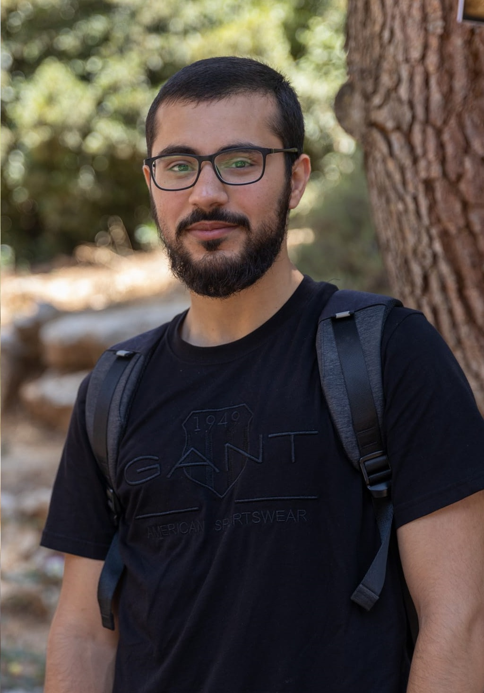

# Mohammad AbuJaber Portfolio

  

This is the repository for my personal portfolio website showcasing my skills, projects, and contact information.

## Table of Contents

- [About Me](#about-me)
- [Skills](#skills)
- [Projects](#projects)
- [Contact](#contact)

## About Me

I am Mohammad AbuJaber, a computer system engineering student at Birzeit University. I am passionate about programming and technology. This portfolio showcases my skills, projects, and contact information.

## Skills

I have a strong background in various programming languages and technologies, including:

- C/C++
- Python
- Java
- MySQL
- HTML & CSS
- Photoshop

## Projects

I have worked on a variety of projects that showcase my programming abilities and problem-solving skills:

1. **Realtime Programming**
   - Description: Multithreading and Multiprocessing Programming
   - [GitHub Repository](https://github.com/Mohammad-AbuJaber/Realtime-Multithreading)

2. **Salary Database Management System**
   - Description: Database Management
   - [GitHub Repository](https://github.com/Mohammad-AbuJaber/Database-Project)

3. **Local Server with Some Services**
   - Description: Socket Programming
   - [GitHub Repository](https://github.com/Mohammad-AbuJaber/Socket-Programming-Network-Project)

4. **Basic Multi-Cycle RISC Processor**
   - Description: Computer Architecture
   - [GitHub Repository](https://github.com/Mohammad-AbuJaber/Computer-Architecture-Projects---------Multi-Cycle-RISC-Processor--MIPS-Assembly/tree/main/Project2)

5. **Simple Encryption/Decryption Algorithm for Text Messages**
   - Description: Shell Scripting
   - [GitHub Repository](https://github.com/Mohammad-AbuJaber/Shell-Scribting-Linux-Lab)

6. **Management Software Using OOP for a Large Company**
   - Description: Object-Oriented Programming with Python
   - [GitHub Repository](https://github.com/Mohammad-AbuJaber/Python-Project-Linux-Lab)

For more projects, visit my [gitHub account](https://github.com/Mohammad-AbuJaber).

## Contact

Feel free to reach out to me for any inquiries, collaborations, or discussions:

- Email: [mohammadabujaber2001@gmail.com](mailto:mohammadabujaber2001@gmail.com)
- WhatsApp: [+970599745046](https://wa.me/+970599745046/?text=Your%20projects%20capture%20my%20attention.)
- Phone: [+970599745046](tel:+970599745046)

You can also visit [my portfolio website](https://mohammad-abujaber.github.io/Portfolio/) to learn more.

---

**Copyrights &COPY; Mohammad AbuJaber**
